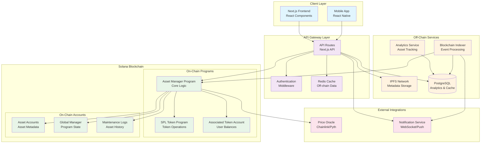
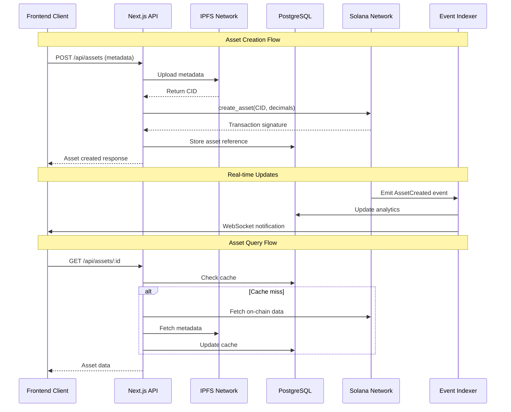
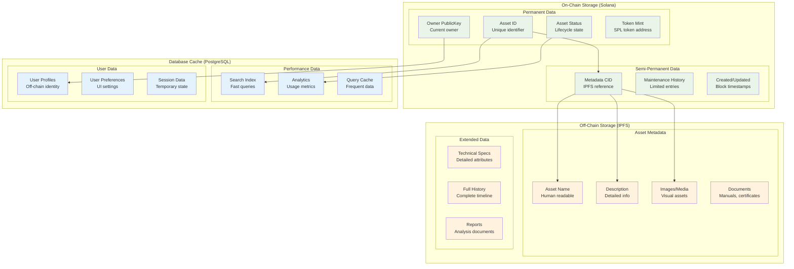
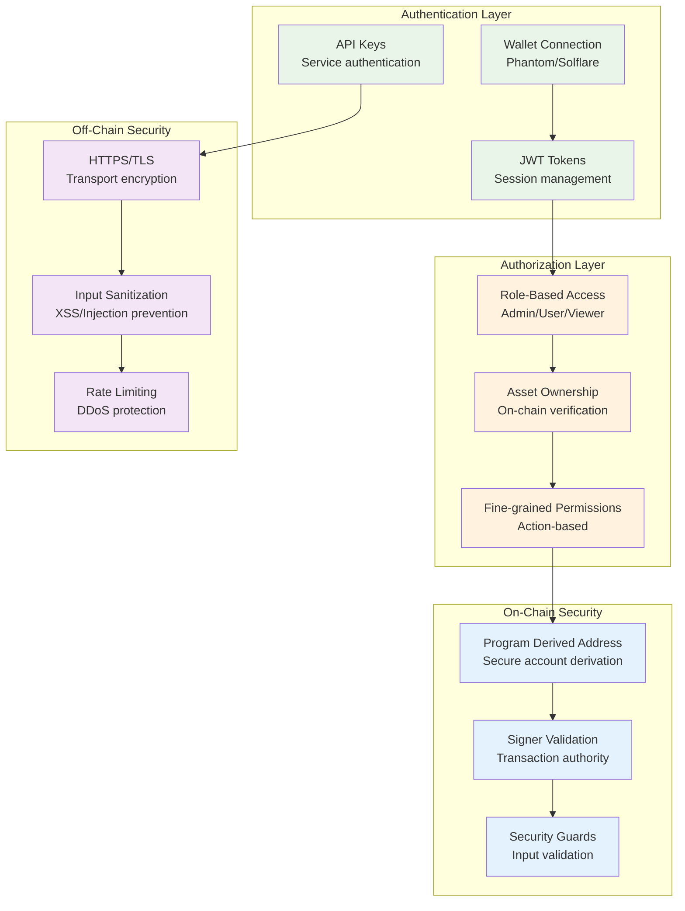
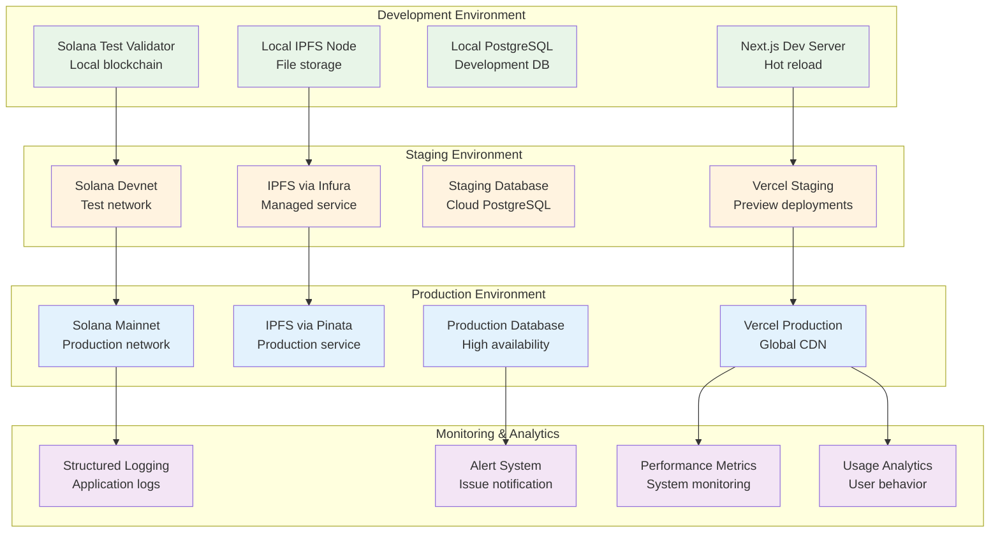

# Solana Asset Manager - Architecture Diagram

## System Overview



## Data Flow Architecture



## Component Architecture

```mermaid
graph LR
    subgraph "Frontend Architecture"
        subgraph "Pages"
            Home[Home Page<br/>Dashboard]
            Assets[Assets Page<br/>Asset List]
            Detail[Asset Detail<br/>Single Asset View]
            Create[Create Asset<br/>Form & Upload]
        end
        
        subgraph "Components"
            AssetCard[Asset Card<br/>Component]
            Form[Asset Form<br/>Component]
            Web3[Web3 Provider<br/>Wallet Connection]
        end
        
        subgraph "Hooks"
            useAssets[useAssets<br/>Custom Hook]
            useWallet[useWallet<br/>Wallet Hook]
            useSolana[useSolana<br/>Program Hook]
        end
    end

    subgraph "API Architecture"
        subgraph "Routes"
            AssetsAPI[/api/assets<br/>CRUD Operations]
            UploadAPI[/api/upload<br/>IPFS Upload]
            AnalyticsAPI[/api/analytics<br/>Dashboard Data]
        end
        
        subgraph "Services"
            SolanaService[Solana Service<br/>Program Interaction]
            IPFSService[IPFS Service<br/>File Management]
            DBService[Database Service<br/>Data Access]
        end
        
        subgraph "Middleware"
            AuthMW[Auth Middleware<br/>JWT Validation]
            RateLimitMW[Rate Limiting<br/>API Protection]
            CORSMW[CORS Middleware<br/>Cross-origin]
        end
    end

    %% Connections
    Home --> AssetsAPI
    Assets --> AssetsAPI
    Detail --> AssetsAPI
    Create --> UploadAPI
    
    useAssets --> AssetsAPI
    useSolana --> AssetsAPI
    
    AssetsAPI --> SolanaService
    UploadAPI --> IPFSService
    AnalyticsAPI --> DBService

    classDef page fill:#e3f2fd
    classDef component fill:#f1f8e9
    classDef hook fill:#fff8e1
    classDef route fill:#fce4ec
    classDef service fill:#f3e5f5
    classDef middleware fill:#e0f2f1

    class Home,Assets,Detail,Create page
    class AssetCard,Form,Web3 component
    class useAssets,useWallet,useSolana hook
    class AssetsAPI,UploadAPI,AnalyticsAPI route
    class SolanaService,IPFSService,DBService service
    class AuthMW,RateLimitMW,CORSMW middleware
```

## Smart Contract Architecture

```mermaid
graph TB
    subgraph "Asset Manager Program"
        subgraph "Instructions"
            Init[initialize_asset_manager<br/>Setup global state]
            Create[create_asset<br/>Mint new asset token]
            Update[update_asset_metadata<br/>Modify asset info]
            Transfer[transfer_asset<br/>Change ownership]
            Maintain[log_maintenance<br/>Record maintenance]
            Retire[retire_asset<br/>End asset lifecycle]
        end
        
        subgraph "Accounts"
            GM[Global Manager<br/>Program authority & stats]
            Asset[Asset Account<br/>Metadata & status]
            Logs[Maintenance Logs<br/>History tracking]
        end
        
        subgraph "Validations"
            Auth[Authority Checks<br/>Permission validation]
            Data[Data Validation<br/>Input sanitization]
            State[State Validation<br/>Business logic]
        end
    end

    subgraph "SPL Token Integration"
        Mint[Token Mint<br/>Unique per asset]
        ATA[Associated Token Account<br/>User ownership]
        Meta[Token Metadata<br/>Standard compliance]
    end

    subgraph "External Programs"
        TokenProg[Token Program<br/>SPL operations]
        ATAProg[ATA Program<br/>Account creation]
        SysProg[System Program<br/>Account management]
    end

    %% Instruction flows
    Init --> GM
    Create --> Asset
    Create --> Mint
    Update --> Asset
    Transfer --> ATA
    Maintain --> Logs
    Retire --> Asset

    %% Validation flows
    Create --> Auth
    Update --> Data
    Transfer --> State

    %% External program calls
    Create --> TokenProg
    Transfer --> ATAProg
    Asset --> SysProg

    classDef instruction fill:#e8f5e8
    classDef account fill:#e3f2fd
    classDef validation fill:#fff3e0
    classDef spl fill:#f3e5f5
    classDef external fill:#fce4ec

    class Init,Create,Update,Transfer,Maintain,Retire instruction
    class GM,Asset,Logs account
    class Auth,Data,State validation
    class Mint,ATA,Meta spl
    class TokenProg,ATAProg,SysProg external
```



## Data Storage Strategy



## Security & Access Control



## Deployment Architecture



## Key Features & Benefits

### Hybrid Architecture Benefits

- **On-Chain**: Immutable ownership, transparent transactions, decentralized trust
- **Off-Chain**: Rich metadata, fast queries, cost-effective storage
- **Best of Both**: Security + Performance + User Experience

### Scalability Features

- **Horizontal Scaling**: API can scale independently
- **Caching Strategy**: Multiple cache layers for performance
- **Event-Driven**: Real-time updates via blockchain events
- **CDN Integration**: Global content delivery

### Security Measures

- **Multi-layer Authentication**: Wallet + JWT + API keys
- **On-chain Validation**: Program-level security guards
- **Input Sanitization**: Protection against common attacks
- **Rate Limiting**: DDoS protection

### Developer Experience

- **Type Safety**: Full TypeScript integration
- **Testing**: Comprehensive test suite for contracts and API
- **Documentation**: Auto-generated API docs
- **Hot Reload**: Fast development iteration

